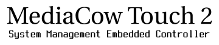

# MediaCow Touch 2 - System Management Embedded Controller
This repository is for software that is to be used on SMEC, the embedded controller in MediaCow Touch 2. 

## Submodules
Due to the immense size of the Linux kernel, the customized kernel is included as a submodule.

